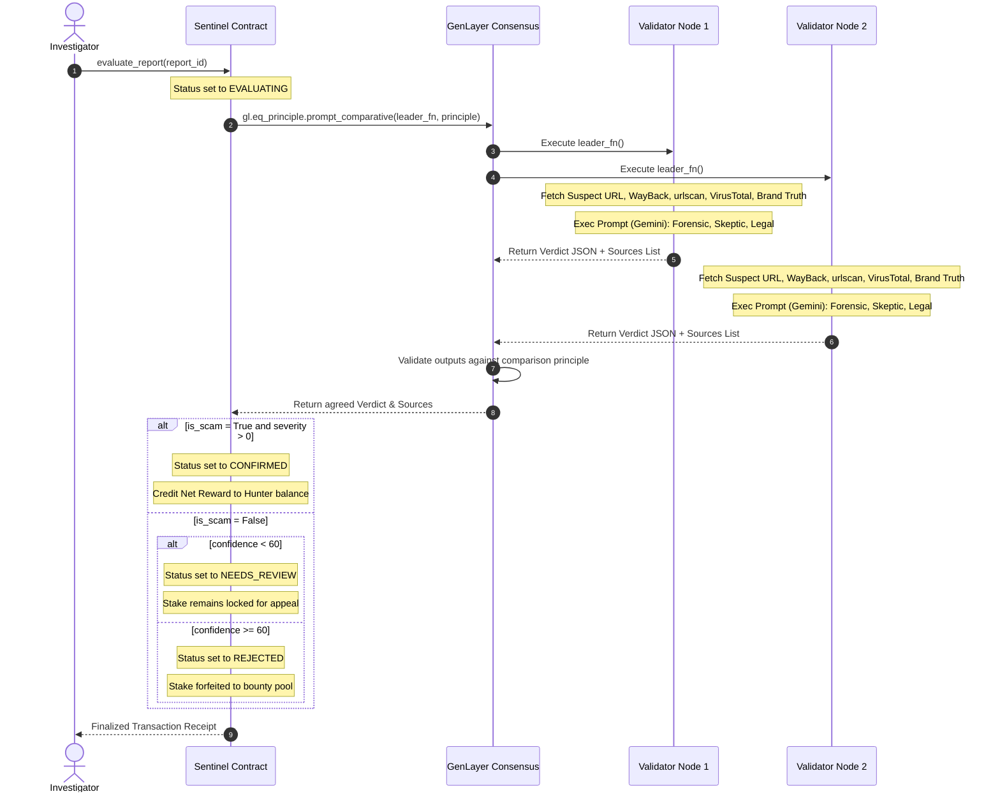

# AI Consensus Pipeline & Multi-Source Cross-Reference

This document explains the decentralized AI consensus architecture of Sentinel v2.

## Consensus Mechanism: `gl.eq_principle.prompt_comparative`

Sentinel v2 replaces single-node non-deterministic blocks with GenLayer's multi-node comparative consensus model. When a report is evaluated, multiple validator nodes run the evaluation logic independently and check their outputs against the consensus principle.

### The Comparison Principle
The consensus checks are governed by the following strict comparison principle:
1. **Scam Detection**: The `is_scam` boolean must match exactly across all validators.
2. **Scam Category**: The `scam_type` categorization (e.g., `phishing`, `wallet_drainer`, `counterfeit`) must match.
3. **Severity Assessment**: The assigned `severity` (0-100) must align within $\pm15$.
4. **Semantic reasoning**: The analyst's `reasoning` text must overlap semantically by citing at least one identical visual, layout, or network artifact (e.g. domain mismatch, trademark logo abuse, etc.).

---

## Multi-Source Cross-Reference

To eliminate false positives/negatives, the consensus leader parses the URL host and queries multiple data registries dynamically:
1. **Live Render**: Fetches active DOM text + screenshot of the suspect page.
2. **Wayback Machine**: Retrieves historical archive data to check registration age and updates.
3. **urlscan.io API**: Queries passive network scans, redirects, and visual matches.
4. **VirusTotal**: Checks passive registrar reputation and community AV detection flags.
5. **Brand Truth Registry**: Extracts canonical domain from the bounty description and renders it to compare logo layout and text against the suspect page.

---

## Multi-Perspective Prompting

The contract prompts the model to act as three distinct personas internally, generating separate text blocks in its structured response:
- **Forensic Analyst**: Focuses on network records, registrar data, HTML code structure, redirects, and reputation logs.
- **Skeptical User**: Evaluates design quality, UX patterns, visual cues, and coercive elements (e.g. urgent alerts, input fields).
- **Brand Lawyer**: Analyzes trademark usage, brand names, copycats, and official copyright declarations.

---

## Confidence Gating & Needs Review

If the consensus outcome is `is_scam = False` but the model's reported `confidence` is **less than 60**:
- The report status transitions to `NEEDS_REVIEW`.
- The hunter's stake remains locked in the contract rather than immediately forfeited.
- This unlocks the **Appeal Flow** (Milestone 4) for further review.
