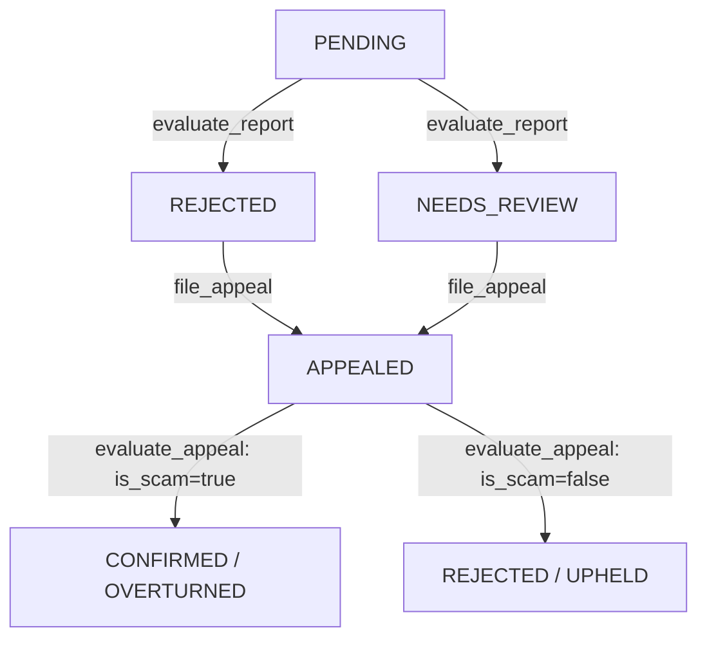

# Dispute & Appeal Mechanism (Milestone 4)

Sentinel features a decentralized re-evaluation process (appeal flow) that protects hunters from incorrect negative verdicts (either `REJECTED` or `NEEDS_REVIEW`) due to AI classification anomalies or transient network glitches.

## State Machine Transitions

A report moves through the following states during the appeal cycle:

---

## Economic & Reputation Rules

To prevent hunters from spamming appeals on valid rejections, filing an appeal is gated by a strict economic deposit:

### 1. The Appeal Fee
- The hunter must pay an **appeal fee** exactly equal to the **original report stake** (`report_stake_of[report_id]`).
- While a report is in `NEEDS_REVIEW`, its original stake remains locked.
- While a report is in `REJECTED`, its original stake has already been added to the bounty pool.

### 2. Outcomes & Payout Adjustments

#### **OVERTURNED (Consensus confirms scam)**
- **Report Status**: Updates to `CONFIRMED`.
- **Appeal Status**: Updates to `OVERTURNED`.
- **Payouts**:
  - The hunter receives the bounty payout: $\text{Base Reward} \times \text{Severity} / 100$, adjusted for any tier-based platform fee waiver.
  - The hunter is refunded their **original report stake** AND their **appeal fee**.
  - If the original status was `REJECTED` (meaning the original stake was already added to the pool), the contract deducts the total payout ($\text{Bounty Reward} + \text{Original Stake}$) from the bounty pool.
  - If the original status was `NEEDS_REVIEW` (meaning the original stake was still locked inside the contract), only the bounty reward is deducted from the bounty pool.
- **Reputation**:
  - If original status was `REJECTED`, the hunter's reputation is corrected: decrement rejected count ($\text{Rejected} - 1$) and increment confirmed count ($\text{Confirmed} + 1$).
  - If original status was `NEEDS_REVIEW`, the hunter's reputation is updated: increment confirmed count ($\text{Confirmed} + 1$).
  - Dynamic score and tier are recalculated.

#### **UPHELD (Consensus rejects scam)**
- **Report Status**: Updates to `REJECTED`.
- **Appeal Status**: Updates to `UPHELD`.
- **Payouts**:
  - The appeal fee is forfeited and added directly to the bounty pool.
  - If the original status was `NEEDS_REVIEW`, the original report stake is also forfeited and added directly to the bounty pool.
- **Reputation**:
  - If original status was `REJECTED`, no reputation change is needed since they were already penalized.
  - If original status was `NEEDS_REVIEW`, the hunter's reputation is updated: increment rejected count ($\text{Rejected} + 1$).
  - Dynamic score and tier are recalculated.
