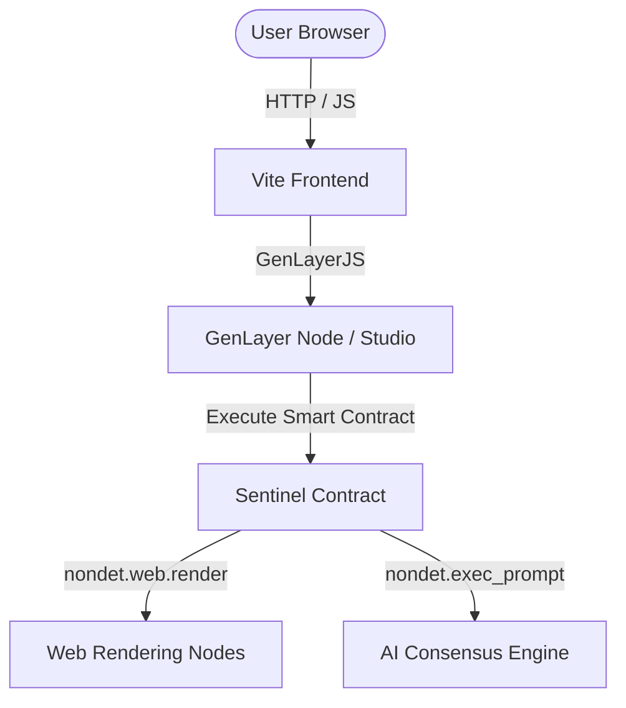
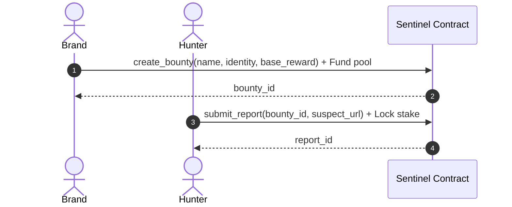
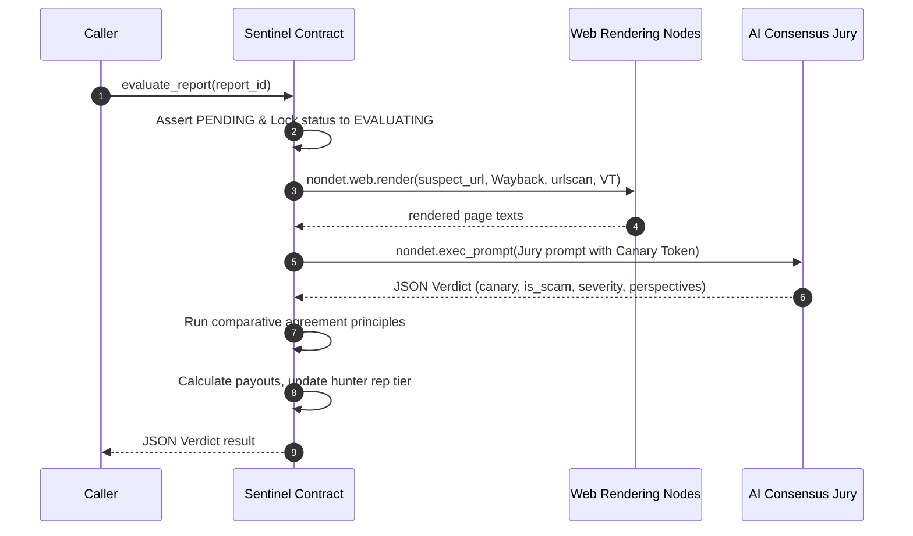
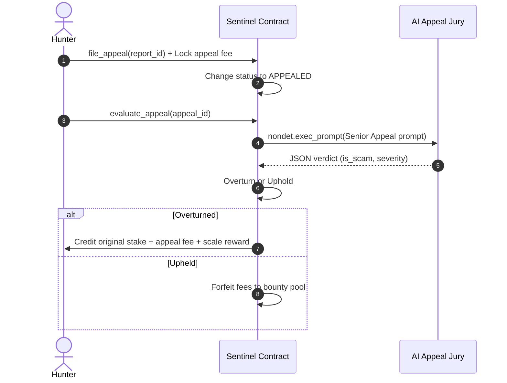

# System Architecture

Sentinel is a decentralized anti-scam bounty registry operating on GenLayer. This document outlines the component architecture and sequence flows.

## Component Diagram

---

## Core Workflows

### 1. Bounty Creation & Reporting

---

### 2. On-Chain AI Consensus Evaluation

When a user calls `evaluate_report(report_id)`, GenLayer nodes execute the consensus sequence:

---

### 3. Appeal & Re-Evaluation Sequence

If a verdict returns `REJECTED` or `NEEDS_REVIEW` due to low confidence, the hunter can file an appeal:

